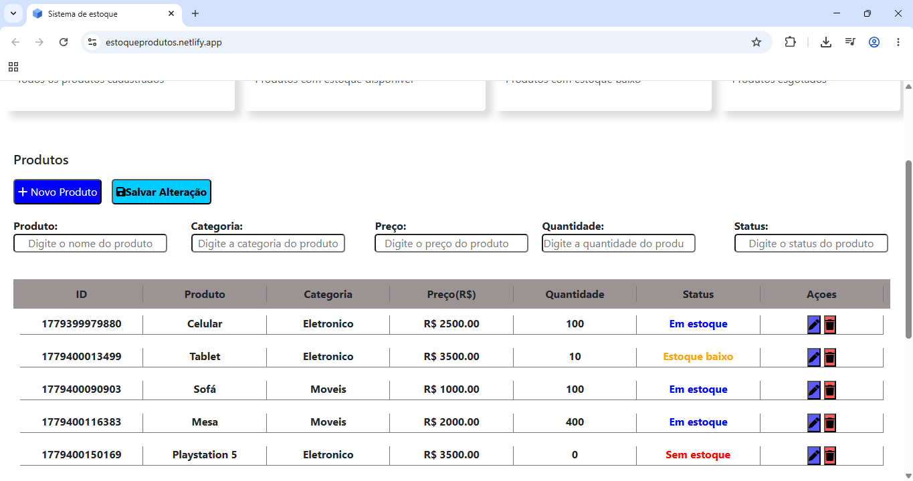

# Sistema de Estoque

Sistema simples de controle de estoque desenvolvido com HTML, CSS e JavaScript.

## Funcionalidades

- Cadastro de produtos
- Controle de quantidade em estoque
- Indicadores de produtos em falta
- Interface simples e responsiva
- Manipulação dinâmica com JavaScript

## Tecnologias Utilizadas

- HTML5
- CSS3
- JavaScript

